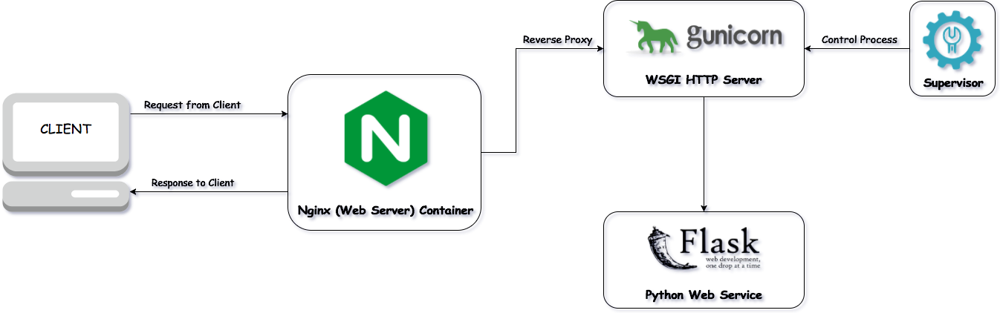

<h1 align="center">
  mongorest
   
</h1>

<h4 align="center">Flask App Serving MongoDB RESTful API Like a Champ 
</h4>

## Resources

[Linode Article on Flask and Gunicorn](https://www.linode.com/docs/guides/flask-and-gunicorn-on-ubuntu/)

[Pragmatic RESTful API](https://www.vinaysahni.com/best-practices-for-a-pragmatic-restful-api)

[Google Resource Oriented Design](https://cloud.google.com/apis/design/resources)

[Microsoft Web API Best Practices](https://docs.microsoft.com/en-us/azure/architecture/best-practices/api-design)

## License

[MIT](https://tldrlegal.com/license/mit-license)